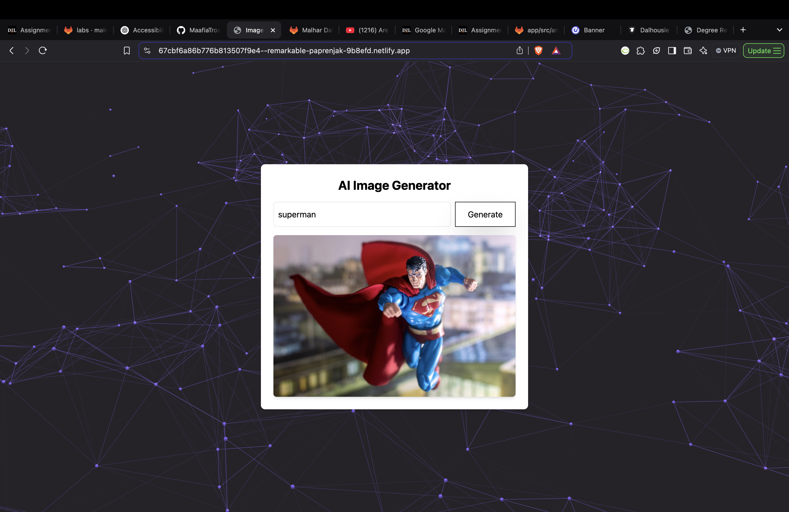

## 🚀 AI Image Generator  

### 🎨 Generate Stunning Images from Text Prompts  
An AI-powered web app that transforms your text into breathtaking images. Designed with an interactive animated background and a sleek, responsive UI.  

## 🔗 Live Demo  
🌐 [Try it Here!](https://67cbf6a86b776b813507f9e4--remarkable-paprenjak-9b8efd.netlify.app/)

---

## 📸 Showcase  

### ✨ User Interface  
  

### ⚡ Example Output  
**Prompt:** "superman"  


---

## 🛠️ How It Works  

1. **Enter a Prompt** → Type what you want to generate  
2. **Click Generate** → The app fetches an AI-generated image  
3. **Enjoy** → Get instant results and explore creativity  

🔹 Uses **Pixabay API** to fetch high-quality images.  
🔹 Built with **Vanta.js** for a stunning animated background.  
🔹 Styled with **Tailwind CSS** for a clean, modern look.  

---

## 🏗️ Built With  

- **Node.js** - Backend runtime environment  
- **Express.js** - API handling  
- **Pixabay API** - Image generation  
- **Tailwind CSS** - Styling  
- **Vanta.js** - Animated background ([Reference](https://www.vantajs.com/))  
- **Three.js** - 3D Graphics  
- **Creative Tim Button Hover Effect** ([Reference](https://www.creative-tim.com/twcomponents/component/button-hover-effects))  

---

## 🚀 Get Started  

```bash
# Clone the repository
git clone https://git.cs.dal.ca/mdmahajan/csci3172/labs/lab5.git
cd AI-Image-Generator

# Install dependencies
npm install

# Start the server
npm start
